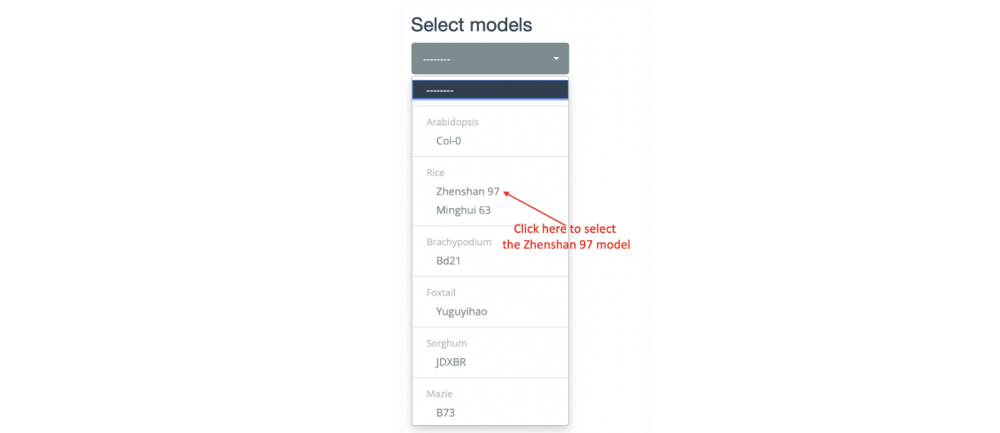
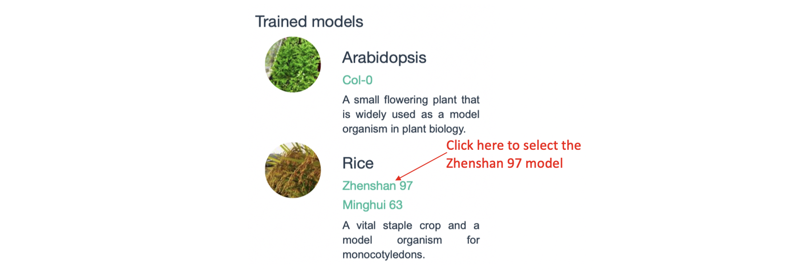
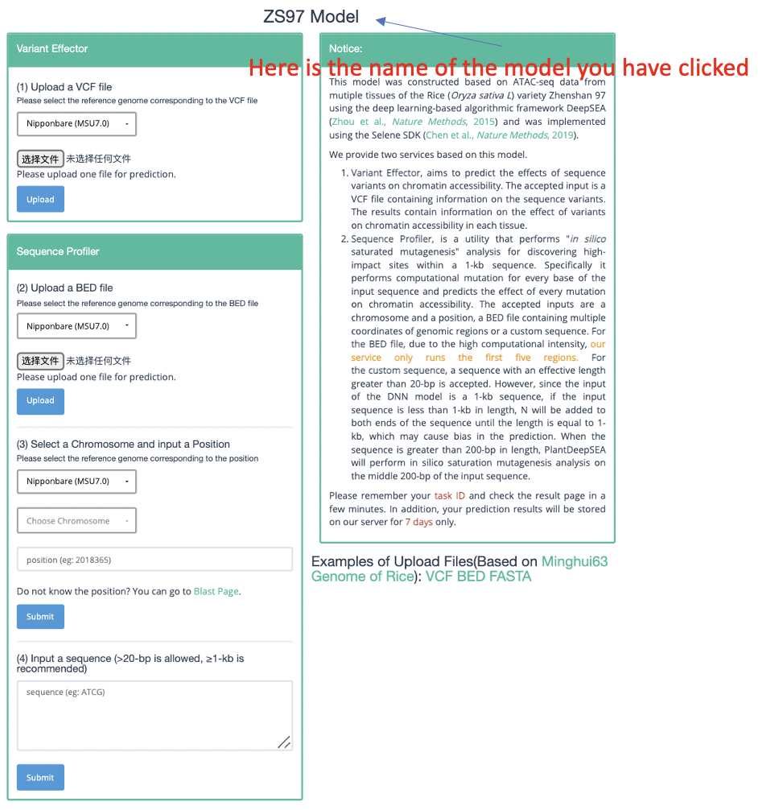

==========================
Model Selection
==========================

You can click the drop-down box on the left side of the home page or the species reference genome name in the middle column to select the appropriate model for prediction (as shown in the figure below). 

Then, jump to the prediction interface, where you will see the model name you have chosen (as shown in the following figure).

