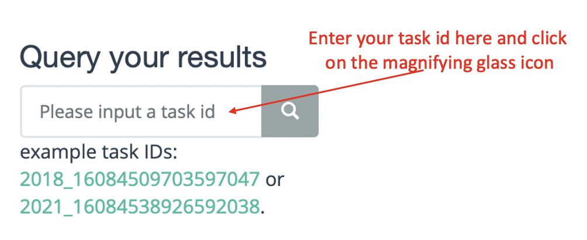

==========================
Query Results 
==========================

There are two ways to query the results of submitted tasks.

You can enter your task ID in the query your results column on the right side of the home page and click on the magnifying glass icon (as shown in the figure below).

You can also click the results button on the home page to enter the result query page, and then enter the task ID in the interface and submit.

After you submit the query, the information as shown in the following figure will be displayed on the right side of the interface.

.. image:: _static/images/q_result/q3_.png
        :width: 50%
        :align: center

The interface will refresh every 10 seconds until the result is returned.
