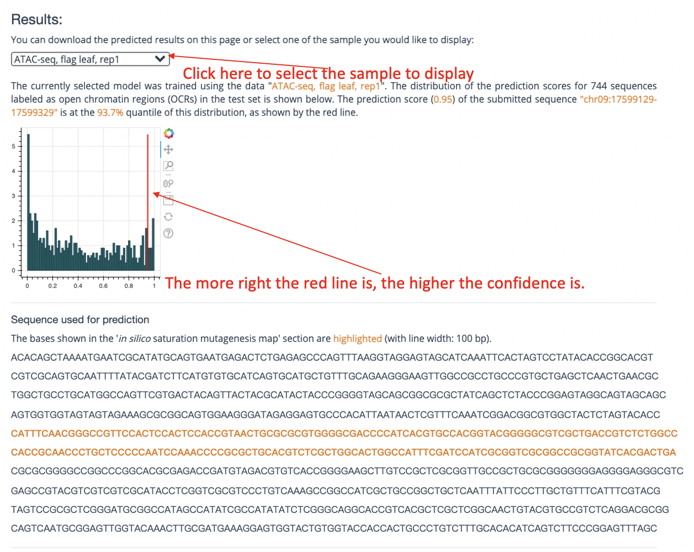
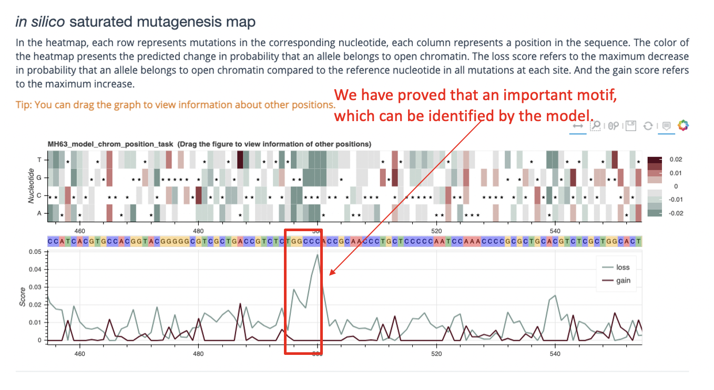
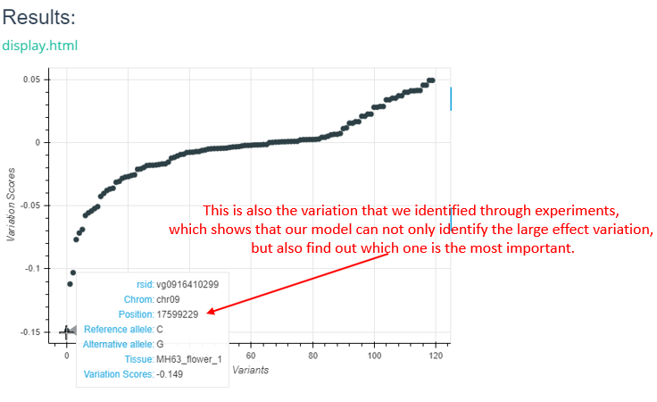
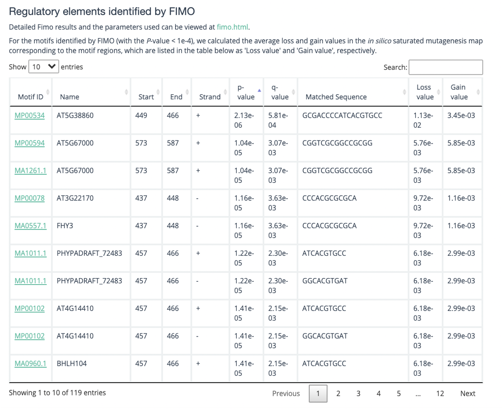

==========================
Interpretation of Results
==========================
After the task is completed, enter the task ID query to obtain the model prediction results. 

Brief Description
------------------------
The left side of the upper part of the result interface is the task ID query column, and the right side shows the download link of the forecast result compression package and task information (as shown in the figure below,take chromosome number and position input as an example).

.. image:: _static/images/result/1__.png
      

The lower part of the result interface is a visual display of the prediction results generated. For different task types, the returned results are slightly different, see the **Main Functions** part of this section for details. Here are two examples (see the figure below) for reference.

Enter the chromosome number and position, and return the following result. The visualization result is generated by bokeh.

For VCF format input, the interactive scatter plot is returned as follows.

In addition, at the bottom of the results interface, you may also get a fimo scan result, if fimo does scan the result(as shown below).

Main Functions
-----------------
**1.Variant Effector**

We predicted changes in chromatin features in a 1-kb region around the mutation (upstream 500 bp and downstream 500 bp). You are supposed to submit a vcf file to generate a background prediciton task, note that there is no limit for the num of lines of your VCF file by now. For each mutation in your VCF file, we predict the scores of changes (may be positive or negative) in every sample of this model, then display all results via scatterplot.

**Input**: A VCF file in any length.

**Output**: After your submission, our system will return a task id, which is essential, go to the result page to find out your prediciton result via the task id. Input your task id to search your result stored on our server (contains the vcf file you submitted and all scores file and result scatterplot in html format)

**2.Sequence Profiler**

Sequence Profiler is used to analyse posible motif or important mutation in a 1-kb DNA sequence from reference genome file. You can generate a prediciton request through 2 ways:

(1)By select a chromomsome and input a position:

After receiveing the chromomsome and position information, we predict the mutation of the middle 200-bp sequence in the range of the middle 1-kb region (for each position of the 200-bp, our server simulate the difference mutation effect of the reference allele and the other 3 alter allele, thus return a 200*4 matrix afterwards, and display the matrix in the html result page through a interactive bokeh heatmap).

**Input**: Select a chromomsome and input a position

**Output**: The web page returns a heatmap, a line plot and fimo result, the heatmap shows the 200*4 matrix and line plot shows continuous positive or negative scores of a possible motif (named gain line or loss line respectively). Fimo result shows possible motif get in meme database of this DNA sequence.

(2)By upload a BED file:

Unlike predicting VCF file in Variant Effector, we only calculate the top 5 lines of your BED file due to our limited GPU resource. For each line in the top 5 lines of your BED file, the server does the same work described in (1).

**Input**: A BED file in any length.

**Output**: Prediction result of the top 5 lines of your BED file, web result description same as (1).

(3)By inputting the FASTA sequence:

Input any length of FASTA sequence you are interested in, and the model will intercept the middle 1000bp (if the input length is greater than 1000bp) or fill 1000bp at both ends (if the input length is less than 1000bp) for prediction.

**Input**: Any length of FASTA sequence you are interested in.

**Output**: The web page returns a heatmap, a line plot and fimo result, the heatmap shows the 200*4 matrix and line plot shows continuous positive or negative scores of a possible motif (named gain line or loss line respectively). Fimo result shows possible motif get in meme database of this DNA sequence.

About the result files
-----------------
.. image:: _static/images/result/RESULT_5.png

**1.The task of predicting sequence** (For example,ID：`2847_16177604444503944 <http://plantdeepsea.ncpgr.cn/search_all_selene_result/?taskid=2847_16177604444503944>`_)

The contents of the compressed package are generally as follows:

=================== ============
File Name           Note
=================== ============
cisml.xml           Motif information (CisML format) matched by 200 bp segment scanned by Fimo
fimo.gff            Motif information (GFF format) matched by 200 bp segment scanned by Fimo
fimo.html           Motif information (HTML format) matched by 200 bp segment scanned by Fimo
fimo.tsv            Motif information (TSV format) matched by 200 bp segment scanned by Fimo
fimo.xml            Motif information (in XML format) matched by 200 bp segment scanned by Fimo
fimo_cut.tsv        Optimized(by PlantDeepSEA) version of fimo.tsv 
do_fimo.bed         Record the position information of 200 bp section
do_fimo.fasta       The FASTA file of the sequence
ism_logits.tsv      log(*P*\ :sub:`mut` / (1-*P*\ :sub:`mut`)) - log(*P*\ :sub:`ref` / (1-*P*\ :sub:`ref`)) , the difference between `logit(mut)` and `logit(ref)` predictions
ism_diffs.tsv       *P*\ :sub:`mut` - *P*\ :sub:`ref` , the difference between `mut ` and `ref` predictions
ism_abs_diffs.tsv   \| *P*\ :sub:`mut` - *P*\ :sub:`ref` \| , the absolute difference between `mut` and `ref` predictions
ism_predictions.tsv After Selene SDK prediction, the input sequence was scored three times per mutation
=================== ============

The mut in the formula in the table refers to mutagenesis.

The interpretation of various formats of Fimo results is detailed `here <https://meme-suite.org/meme/doc/fimo.html>`_.

ism_predictions.tsv is the score of each mutation of the input 1000bp sequence three times after the prediction of Selene SDK. It records the absolute value of the difference, the true value of the difference, the Logits value and the true score of each mutation sequence.

Each PDF file in the compressed package is the drawing of each organization.

**2.VCF variation annotation task** (For example,ID：`2870_16178001127678075 <http://plantdeepsea.ncpgr.cn/search_all_selene_result/?taskid=2870_16178001127678075>`_)

The contents of the compressed package are generally as follows:

================================== ====================================================================  
File Name                          Note                
================================== ====================================================================  
dep1_MH63_ref.vcf                  VCF files submitted by users
dep1_MH63_ref_abs_diffs.tsv        \| *P*\ :sub:`mut` - *P*\ :sub:`ref` \| , Absolute value of difference before and after mutation of each locus
dep1_MH63_ref.alt_predictions.tsv  Scoring value of each locus variation
dep1_MH63_ref_diffs.tsv            *P*\ :sub:`mut` - *P*\ :sub:`ref` , value of difference before and after mutation of each locus
dep1_MH63_ref_logits.tsv           Logits value before mutation of each locus
dep1_MH63_ref.ref_predictions.tsv  Score before variation of each locus
================================== ====================================================================

The above TSV files are the scoring files predicted by `selene SDK <https://selene.flatironinstitute.org/master/index.html>`_

